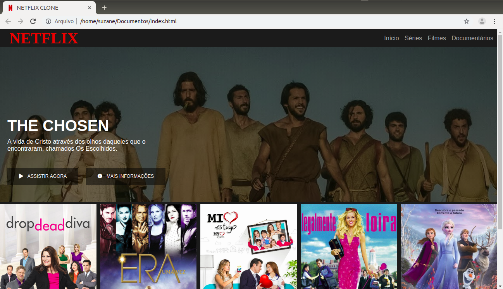

# Recriando a Interface do Netflix :movie_camera:

 Este projeto apresenta uma recriação da interface do site de streaming Netflix, utilizando tecnologias simples como HTML5, CSS3 e JavaScript. Aborda-se conceitos sobre como estruturar um layout, técnicas de CSS3 com containers e variáveis, como posicionar os elementos com Flexbox e como utilizar plugins Jquery a favor da aplicação. 
 Este é um desafio de projeto da Digital Innovation One no bootcamp HTML Web Developer.

## :gear: Tecnologias

- HTML5
- CSS3
- JavaScript

## :art: Layout

